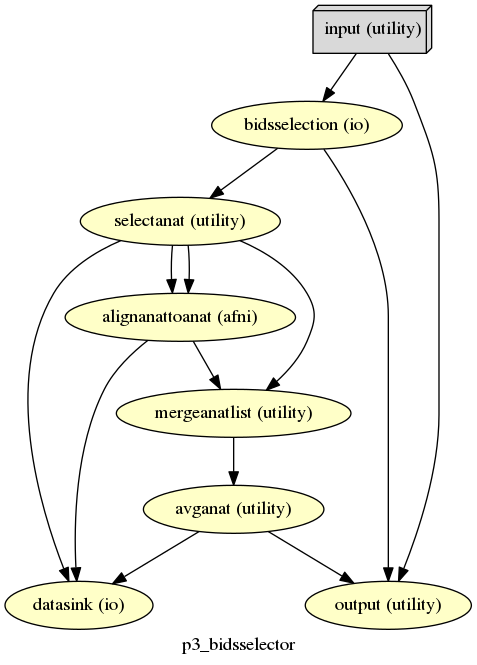
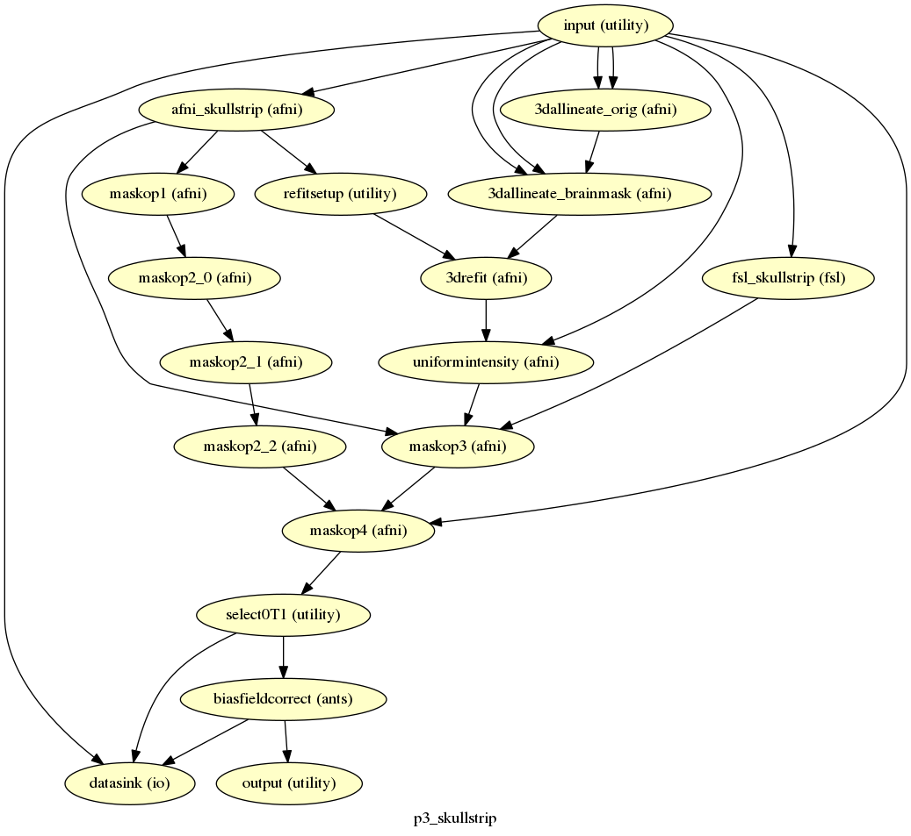
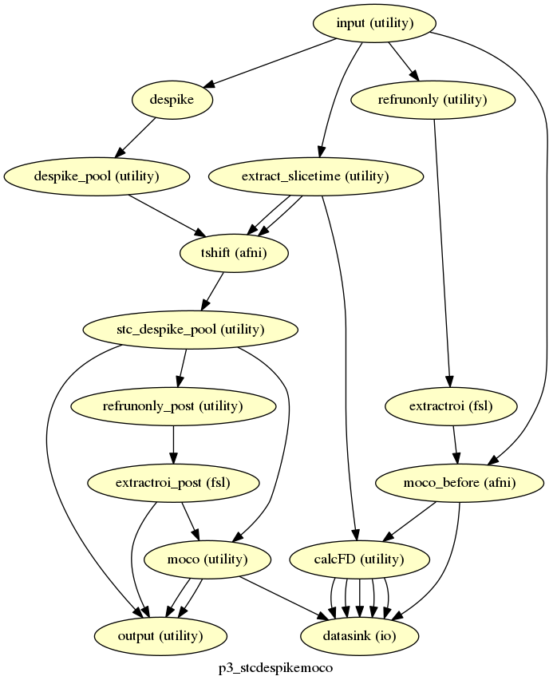
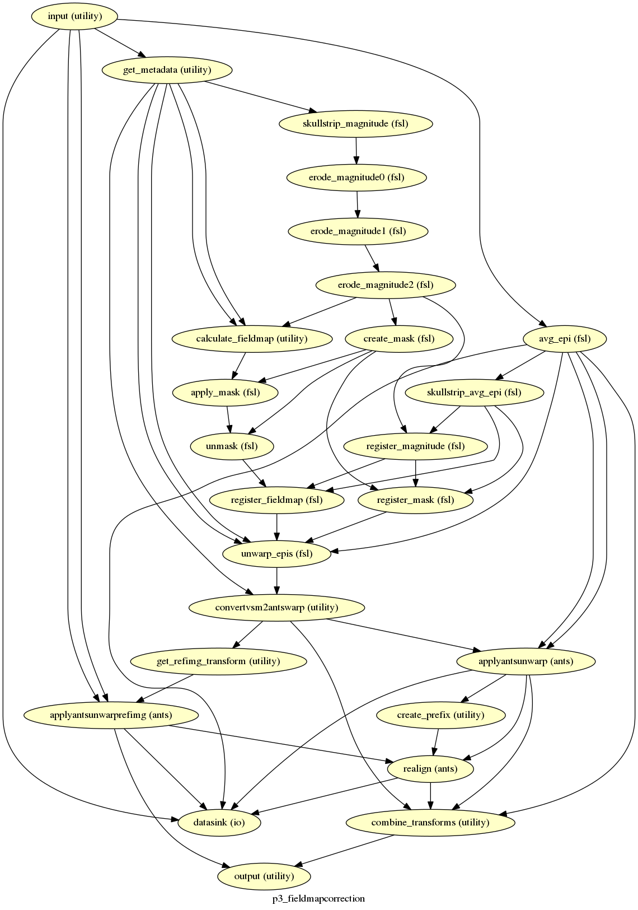
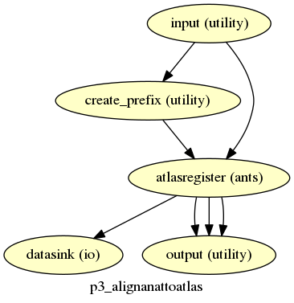
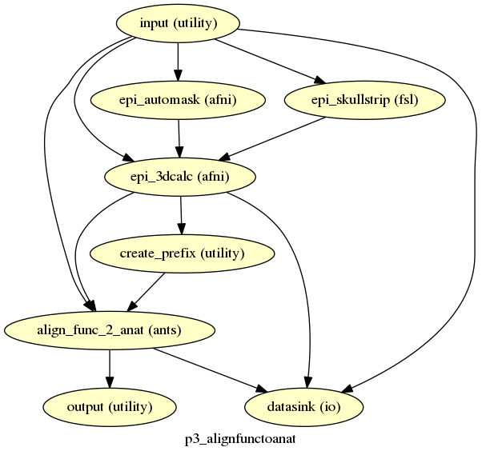
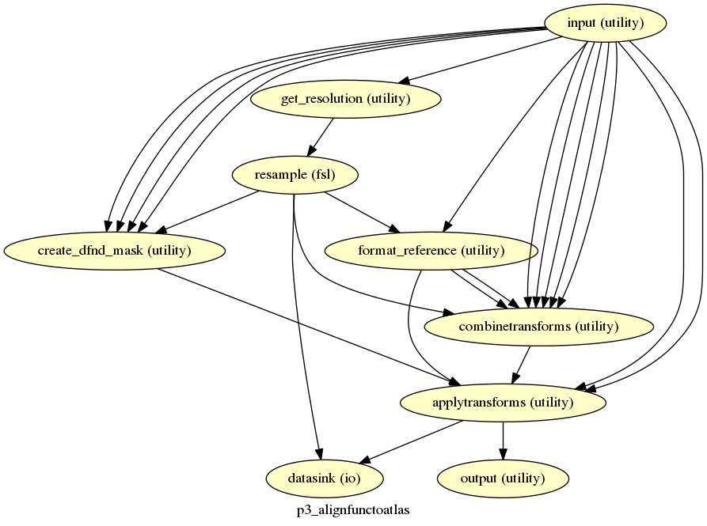
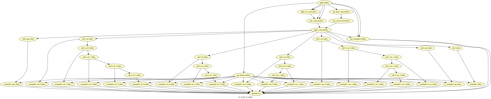

.. _`Default Workflows`:

Workflows
---------
p3_bidsselector
^^^^^^^^^^^^^^^

description
"""""""""""
The starting workflow of p3. Takes in a list of subjects from the 'subject' settings then processes the BIDS dataset for those
subjects using the 'bids_query' setting. This workflow also averages the list of anatomical if the "avganat" setting is set.

output
""""""
    :anat:
        path to anatomical image

    :func:
        list of paths to functional images

    :subject:
        string of current subject being processed

p3_freesurfer
^^^^^^^^^^^^^

.. image:: ../_static/imgs/p3_freesurfer.png

description
"""""""""""
Runs recon-all (and recon1 for the skullstrip).

input
"""""
    :T1:
        path to T1 image

    :subject:
        string of current subject being processed

output
""""""
    :orig:
        freesurfer brainmasked T1

    :brainmask:
        freesurfer brainmask

    :aparc_aseg:
        segmentation volume

p3_skullstrip
^^^^^^^^^^^^^

description
"""""""""""
Generates a skullstrip on the input T1. Uses Jonathan Power's skullstrip algorithm that combines AFNI,FSL, and Freesurfer.

input
"""""
    :orig:
        freesurfer brainmasked T1

    :brainmask:
        freesurfer brainmask

    :T1:
        path to T1 image

output
""""""
    :T1_skullstrip:
        path to skullstripped T1 image

    :allineate_freesurfer2anat:
        3dAllineate transfrom from freesurfer to anatomy image

p3_stcdespikemoco
^^^^^^^^^^^^^^^^^

description
"""""""""""
Does slice time correction, despiking, and motion correction. Produces the motion numbers, FDs and tmask.

input
"""""
    :func:
        list of paths to functional images

output
""""""
    :refimg:
        path to functional reference image

    :func_stc_despike:
        list of paths to slice time corrected/despiked functional images

    :warp_func_2_refimg:
        list of ANTs warp field transforms from functional to reference

    :func_aligned:
        list of paths to aligned functional images

p3_fieldmapcorrection
^^^^^^^^^^^^^^^^^^^^^

description
"""""""""""
Does FSL fieldmap correction on each functional image and then realigns the images back to the reference image.

input
"""""
    :func:
        list of paths to functional images

    :refimg:
        path to functional reference image

    :func_aligned:
        list of paths to aligned functional images

output
""""""
    :warp_fmc:
        list of ANTs warp field transforms for field map correction (aligned functional --> field map corrected functional)

    :refimg:
        path to functional reference image (field map corrected)

p3_alignanattoatlas
^^^^^^^^^^^^^^^^^^^

description
"""""""""""
Aligns the anatomy image to the atlas.

input
"""""
    :T1_skullstrip:
        path to skullstripped T1 image

output
""""""
    :affine_anat_2_atlas:
        ANTs affine tranform from anatomical to atlas

    :warp_anat_2_atlas:
        ANTs warp field transform from anatomical to atlas

    :anat_atlas:
        atlas aligned anatomical image

p3_alignfunctoanat
^^^^^^^^^^^^^^^^^^

description
"""""""""""
Aligns the functional reference to the anatomical image.

input
"""""
    :refimg:
        path to functional reference image (field map corrected if desired)

    :T1_skullstrip:
        path to skullstripped T1 image

output
""""""
    :affine_func_2_anat:
        ANTs affine tranform from functional reference to anatomical

    :warp_funct_2_anat:
        ANTs warp field transform from functional reference to anatomical

p3_alignfunctoatlas
^^^^^^^^^^^^^^^^^^^

description
"""""""""""
Combines all the transforms and then aligns the functional images to the atlas.

input
"""""
    :func:
        list of paths to functional images

    :func_stc_despike:
        list of paths to slice time corrected/despiked functional images

    :warp_func_2_refimg:
        list of ANTs warp field transforms from functional to reference

    :warp_fmc:
        list of ANTs warp field transforms for field map correction (aligned functional --> field map corrected functional)

    :refimg:
        path to functional reference image (no field map correction)

    :affine_func_2_anat:
        ANTs affine tranform from functional reference to anatomical

    :warp_funct_2_anat:
        ANTs warp field transform from functional reference to anatomical

    :affine_anat_2_atlas:
        ANTs affine tranform from anatomical to atlas

    :warp_anat_2_atlas:
        ANTs warp field transform from anatomical to atlas

output
""""""
    :func_atlas:
        list of paths to atlas aligned functional images

p3_create_fs_masks
^^^^^^^^^^^^^^^^^^

description
"""""""""""
Create masks from the freesurfer outputs.

input
"""""
    :aparc_aseg:
        segmentation volume

    :orig:
        freesurfer brainmasked T1

    :affine_anat_2_atlas:
        ANTs affine tranform from anatomical to atlas

    :warp_anat_2_atlas:
        ANTs warp field transform from anatomical to atlas

    :anat_atlas:
        atlas aligned anatomical image

    :func_atlas:
        list of paths to atlas aligned functional images

    :T1:
        path to T1 image

output
""""""
    :func_atlas:
        list of paths to atlas aligned functional images

.. include:: ../links.rst
