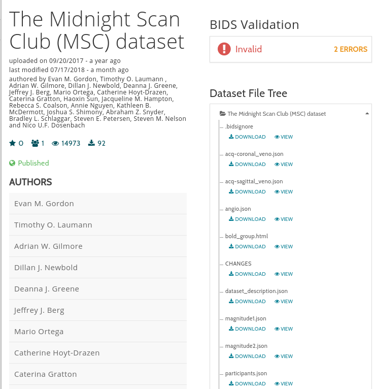

.. _`Basic Example`:

Basic Example
-------------
1. Obtain a BIDS_ dataset. You can convert your own data or use one of the shared
   BIDS_ dataset on OpenNeuro_. In this tutorial, we use the `MSC dataset`_.

    The BIDS version of the MSC dataset.

2. Download the p3 `Docker Image`_/`Singularity Image`_. If you use Docker

.. include:: ../links.rst
